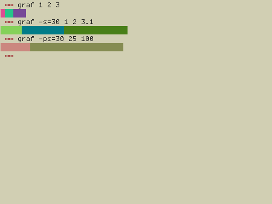

<h1 align="center">graf 📊</h1>

<p align="center">Display colorful representations of data</p>
<br><br>
<p align="center"></p>

**Usage:**

```
Usage: graf [OPTION] [NUMBER]...
Display colorful representations of data

--help, -h: Display this information
--size=[NUMBER], -s: Change the bar's size
--percent, -p: Generate a percent bar
```
